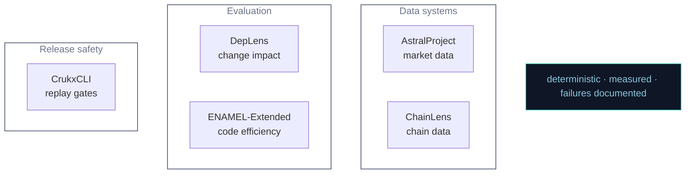
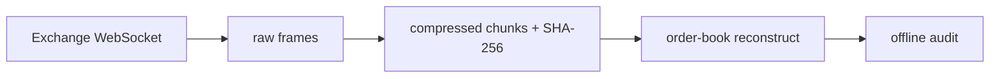
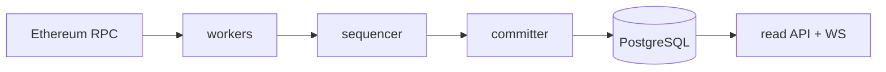
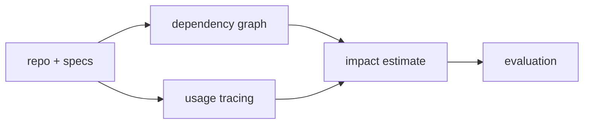
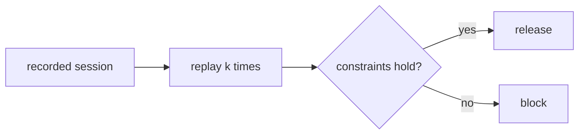
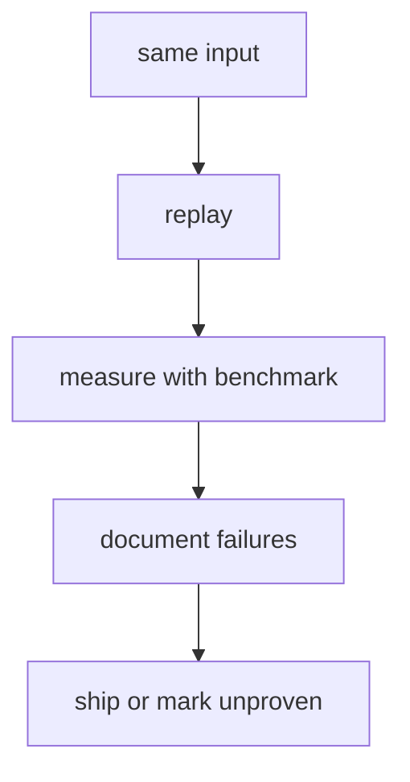

<div align="center">
  
</div>

<br/>

> I build infrastructure that has to prove its own claims — indexers, benchmarks, replay systems, and release gates where correctness is tested, performance is measured, and anything unproven is labelled as such.

**Systems engineering · AI evaluation · developer infrastructure**
<br/>Rust · Python — Freelance / contract via [Crukx-dev](https://github.com/Crukx-dev) · Project work for IISER Bhopal
<br/>Based in Bhopal, India (IST)

> **Currently:** [AstralProject](https://github.com/VarunGore36/AstralProject) — preparing a supervised 72-hour capture soak

---

## Independent projects, shared standard

> Each project below is standalone — no shared runtime, no pipeline between them. What they share is how they're built.



---

## Selected work

### AstralProject — reproducible market-data measurement

[](https://github.com/VarunGore36/AstralProject)
[](https://astral-project-ruddy.vercel.app/)

> Lossless, hash-verified market-data capture and order-book reconstruction. Research and simulation only.

**Evidence:** best bid/ask matched venue depth on 300/300 live checks · 26 hostile-payload parser tests · failures documented in-repo



---

### ChainLens — concurrent Ethereum mainnet indexer

[](https://github.com/VarunGore36/ChainLens)
[](https://chain-lens-chi.vercel.app/)

> Rust + Tokio indexer. Blocks, transactions, receipts and logs into PostgreSQL with a read API. Reorg-safe, crash-resumable.

**Evidence:** 93 tests · 392 blocks/sec pipeline benchmark · 150 ns/block decode



---

### DepLens — can history predict breakage?

[](https://github.com/VarunGore36/DepLens)

> Do dependency graphs, code usage and git history predict the impact of a change before it lands? End-to-end pipeline tested against real repos.

**Evidence:** 91 tests · 42-case dataset · reproduction script · claims marked proven / unproven



---

### ENAMEL-Extended — passing tests isn't fast code

[](https://github.com/VarunGore36/ENAMEL-Extended)
[](https://enamel-extended.vercel.app)
[](https://arxiv.org/abs/2406.06647)

> Reimplementation of [ENAMEL](https://arxiv.org/abs/2406.06647) (ICLR 2025) for open-source models: passing tests isn't the same as writing fast code.

**Evidence:** 13 models · 161 problems · 612 tests · eff@1 vs pass@1 gap measured

```mermaid
flowchart LR
    Q[problems + samples] --> M[sandboxed measure]
    M --> S[eff@1 scoring]
    S --> R[report + CIs]
```

---

### CrukxCLI — deterministic release gates

[](https://github.com/Crukx-dev/CrukxCLI)

> `crukx gate` replays a recorded agent session *k* times and blocks the release if constraints fail. Deterministic, offline, no account needed.

**Evidence:** pass^k replay · hash-chained, tamper-evident session logs



---

## How I work



1. **Deterministic before fast** — same input, same output, every replay.
2. **Measure before optimising** — every optimisation ships with a benchmark.
3. **Failures are documented, not hidden** — partial results and unverified claims stay in the README.

---

## Stack

**Core:** Rust · Python · Tokio · PostgreSQL
<br/>**Infra:** Docker · Linux
<br/>**Also:** C, C++, Go, TypeScript, JavaScript, Solidity / EVM

<!-- Stack icons served via GitHub Camo -->
<p>
  <a href="https://skillicons.dev">
    
  </a>
</p>

---

## Contact

<div align="center">

[](https://www.linkedin.com/in/varun-gore-14187632a/)
[](mailto:varungore1@gmail.com)

</div>
