 

**Rust · Python** &nbsp;|&nbsp; Freelance / contract via [Crukx-dev](https://github.com/Crukx-dev) &nbsp;|&nbsp; Project work for IISER Bhopal &nbsp;|&nbsp; Bhopal, India (IST)

 

I build infrastructure that has to prove its own claims: indexers, benchmarks, replay systems and release gates, where correctness is tested, performance is measured, and anything unproven is labelled as such.

 

Every project below is standalone. No shared runtime, no pipeline between them. What they share is the production standard:

1. **Deterministic before fast.** Same input, same output, every replay.
2. **Measure before optimising.** Every optimisation ships with a benchmark.
3. **Failures are documented, not hidden.** Partial results and unverified claims stay in the README.

**AstralProject** is lossless, hash-verified market-data capture and order-book reconstruction. Research and simulation only.
Raw exchange frames are stored as compressed, SHA-256-checked chunks, the order book is rebuilt offline, and an audit pass checks it.
**Status:** a supervised 72-hour capture soak is in preparation. The 300/300 figure is a top-of-book check on live data, not a proof of full-book correctness; the soak is the real test.

[Repo](https://github.com/VarunGore36/AstralProject) &nbsp;/&nbsp; [Live site](https://astral-project-ruddy.vercel.app/)

<table>
<tr>
<td width="50%" valign="top">

Rust + Tokio indexer. Blocks, transactions, receipts and logs into PostgreSQL with a read API. Reorg-safe, crash-resumable.

[Repo](https://github.com/VarunGore36/ChainLens) &nbsp;/&nbsp; [Live](https://chain-lens-chi.vercel.app/)

</td>
<td width="50%" valign="top">

Do dependency graphs, code usage and git history predict the impact of a change before it lands? An end-to-end pipeline tested against real repos, with every claim marked proven or unproven.

[Repo](https://github.com/VarunGore36/DepLens)

</td>
</tr>
<tr>
<td width="50%" valign="top">

A reimplementation of [ENAMEL](https://arxiv.org/abs/2406.06647) (ICLR 2025) for open-source models. It measures the gap between code that passes tests and code that runs fast, with confidence intervals.

[Repo](https://github.com/VarunGore36/ENAMEL-Extended) &nbsp;/&nbsp; [Live](https://enamel-extended.vercel.app) &nbsp;/&nbsp; [Paper](https://arxiv.org/abs/2406.06647)

</td>
<td width="50%" valign="top">

`crukx gate` replays a recorded agent session *k* times and blocks the release if constraints fail. Deterministic, offline, no account needed. Session logs are hash-chained and tamper-evident.

[Repo](https://github.com/Crukx-dev/CrukxCLI)

</td>
</tr>
</table>

\* 392 blocks/sec is the pipeline's committer path on a mock RPC with synthetic fixtures (about 1 tx per block); hardware was not recorded. It is not a mainnet figure. The 150 ns/block figure is a criterion decode benchmark. Test counts were taken from each repo at the time of writing.

<!--
TODO before publishing (these are the results a skeptical reader will look for, and I did not have them):
- DepLens: state the verdict. Does history predict breakage on the 42-case dataset? Give the headline number and where it fails.
- ENAMEL-Extended: state the measured eff@1 vs pass@1 gap, with the CI.
- CrukxCLI: add one demonstrated result, e.g. a replay that blocked a bad release.
- ChainLens: re-check the test count (repo says 232) and either record benchmark hardware or keep the footnote above.
-->

**Rust** &nbsp;Tokio · Axum · SQLx · Alloy · Tungstenite · rustls · zstd · Ratatui · criterion
**Python** &nbsp;pytest · Ruff · uv · NumPy · Matplotlib · EvalPlus · vLLM
**Infra** &nbsp;PostgreSQL · Docker · Prometheus · Grafana · GitHub Actions · Linux

 

[LinkedIn](https://www.linkedin.com/in/varun-gore-14187632a/) &nbsp;/&nbsp; [Email](mailto:varungore1@gmail.com) &nbsp;/&nbsp; [Crukx-dev](https://github.com/Crukx-dev)

 

Anything unproven stays labelled as unproven.

