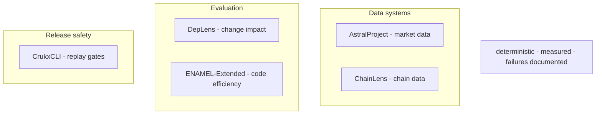
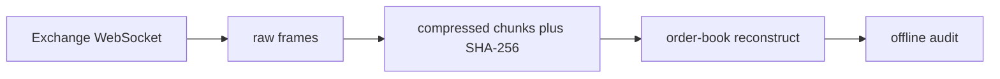
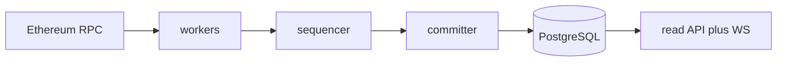
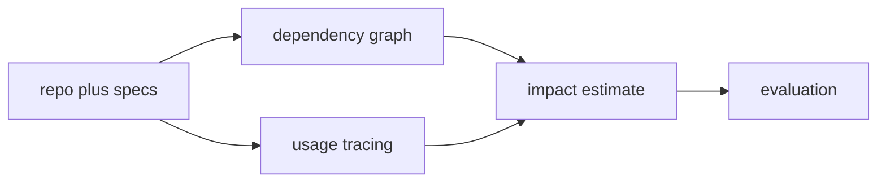
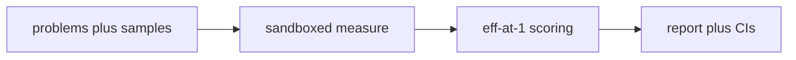
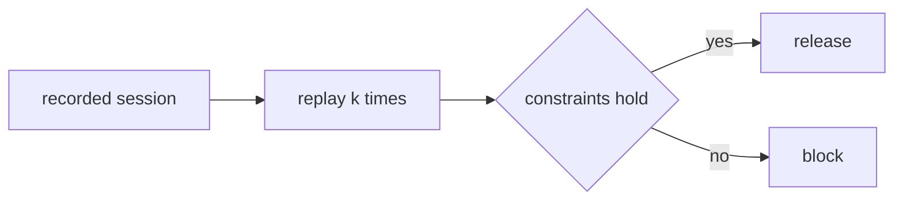
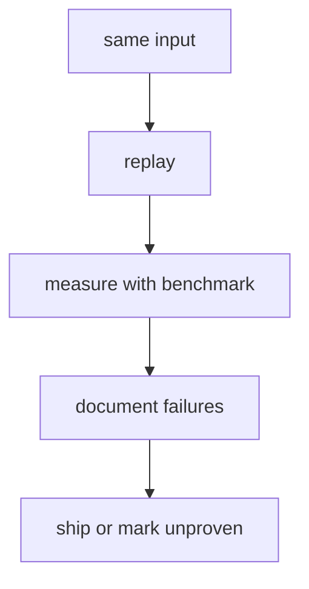

  

 

> I build infrastructure that has to prove its own claims — indexers, benchmarks, replay systems, and release gates where correctness is tested, performance is measured, and anything unproven is labelled as such.

**Systems engineering · AI evaluation · developer infrastructure**
 Rust · Python — Freelance / contract via [Crukx-dev](https://github.com/Crukx-dev) · Project work for IISER Bhopal
 Based in Bhopal, India (IST)

> **Currently:** [AstralProject](https://github.com/VarunGore36/AstralProject) — preparing a supervised 72-hour capture soak

---

## Independent projects, shared standard

> Each project below is standalone — no shared runtime, no pipeline between them. What they share is how they're built.

---

## Selected work

### AstralProject — reproducible market-data measurement

> Lossless, hash-verified market-data capture and order-book reconstruction. Research and simulation only.

**Evidence:** best bid/ask matched venue depth on 300/300 live checks · 26 hostile-payload parser tests · failures documented in-repo

---

### ChainLens — concurrent Ethereum mainnet indexer

> Rust + Tokio indexer. Blocks, transactions, receipts and logs into PostgreSQL with a read API. Reorg-safe, crash-resumable.

**Evidence:** 93 tests · 392 blocks/sec pipeline benchmark · 150 ns/block decode

---

### DepLens — can history predict breakage?

> Do dependency graphs, code usage and git history predict the impact of a change before it lands? End-to-end pipeline tested against real repos.

**Evidence:** 91 tests · 42-case dataset · reproduction script · claims marked proven / unproven

---

### ENAMEL-Extended — passing tests isn't fast code

> Reimplementation of [ENAMEL](https://arxiv.org/abs/2406.06647) (ICLR 2025) for open-source models: passing tests isn't the same as writing fast code.

**Evidence:** 13 models · 161 problems · 612 tests · eff@1 vs pass@1 gap measured

---

### CrukxCLI — deterministic release gates

> `crukx gate` replays a recorded agent session *k* times and blocks the release if constraints fail. Deterministic, offline, no account needed.

**Evidence:** pass^k replay · hash-chained, tamper-evident session logs

---

## How I work

1. **Deterministic before fast** — same input, same output, every replay.
2. **Measure before optimising** — every optimisation ships with a benchmark.
3. **Failures are documented, not hidden** — partial results and unverified claims stay in the README.

---

## Stack

<!-- All icons below are served via GitHub Camo -->

| | |
|---|---|
| Languages |  |
| Rust |             |
| Python |        |
| Data / Infra |    |

---

## Contact

