 

I build infrastructure that has to prove its own claims: indexers, benchmarks, replay systems and release gates, where correctness is tested, performance is measured, and anything unproven is labelled as such.

 

 

<b>Rust</b> Tokio · Axum · SQLx · Alloy · Tungstenite · rustls · zstd · criterion &nbsp;&nbsp;|&nbsp;&nbsp;
<b>Python</b> pytest · Ruff · uv · NumPy · Matplotlib · EvalPlus · vLLM &nbsp;&nbsp;|&nbsp;&nbsp;
<b>Infra</b> PostgreSQL · Docker · Prometheus · Grafana · GitHub Actions · Linux

 

<table>
<tr>
<td width="25%" align="center" valign="top">

 <b>AstralProject</b> 
Lossless, hash-verified market-data capture and order-book reconstruction. Research and simulation only.  
<code>300/300 top-of-book checks</code> <code>72-hour soak in preparation</code>  
<a href="https://github.com/VarunGore36/AstralProject">repo</a> · <a href="https://astral-project-ruddy.vercel.app/">live</a>
</td>
<td width="25%" align="center" valign="top">

 <b>ChainLens</b> 
Concurrent Ethereum mainnet indexer in Rust and Tokio. Reorg-safe, crash-resumable, PostgreSQL-backed.  
<code>232 tests</code> <code>150 ns/block decode</code> <code>392 blk/s*</code>  
<a href="https://github.com/VarunGore36/ChainLens">repo</a> · <a href="https://chain-lens-chi.vercel.app/">live</a>
</td>
<td width="25%" align="center" valign="top">

 <b>DepLens</b> 
Can dependency graphs, code usage and git history predict what a change will break?  
<code>91 tests</code> <code>42-case dataset</code> <code>claims marked proven / unproven</code>  
<a href="https://github.com/VarunGore36/DepLens">repo</a>
</td>
<td width="25%" align="center" valign="top">

 <b>ENAMEL-Extended</b> 
Reimplements <a href="https://arxiv.org/abs/2406.06647">ENAMEL</a> (ICLR 2025) for open-source models. Passing tests isn't the same as writing fast code.  
<code>13 models</code> <code>161 problems</code> <code>612 tests</code>  
<a href="https://github.com/VarunGore36/ENAMEL-Extended">repo</a> · <a href="https://enamel-extended.vercel.app">live</a>
</td>
</tr>
</table>

\* 392 blocks/sec is the ChainLens pipeline's committer path on a mock RPC with synthetic fixtures (about 1 tx per block). Hardware was not recorded, so it is not a mainnet figure. 150 ns/block is a criterion decode benchmark. Test counts were taken from each repo at the time of writing.

<!--
TODO before publishing. These are the results a skeptical reader will look for, and I did not have them:
- DepLens: state the verdict. Does history predict breakage on the 42-case dataset? Give the headline number and where it fails.
- ENAMEL-Extended: state the measured eff@1 vs pass@1 gap, with the confidence interval.
- ChainLens: re-check the test count (repo said 232) and either record the benchmark hardware or keep the footnote.
-->

 

[LinkedIn](https://www.linkedin.com/in/varun-gore-14187632a/) &nbsp;·&nbsp; [Email](mailto:varungore1@gmail.com) &nbsp;·&nbsp; [GitHub](https://github.com/VarunGore36)

